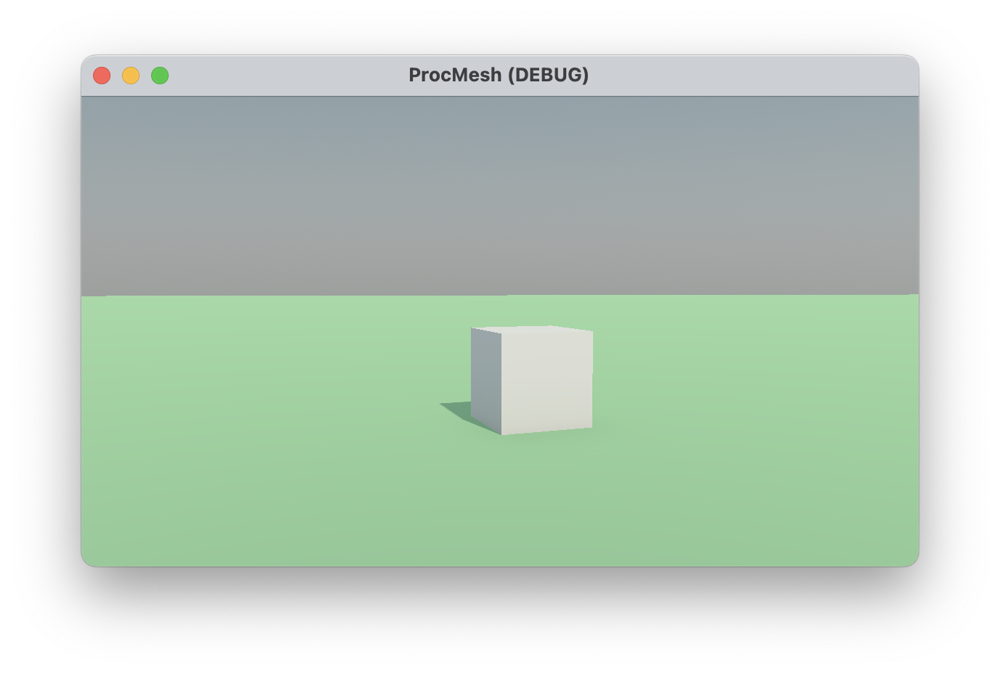

# Procedural Mesh Toy

A playground for experimenting with procedural mesh generation in Godot.

## Getting Started

To get started with this project, you will need Godot 4.2 with Mono support.

## TODO
### Procedural Meshes
- [ ] Define classes for composable meshes
- [ ] Allow meshes to be defined outside of C# (JSON, etc.)

### UI
- [ ] Don't capture cursor
- [ ] Orbit camera with right mouse button
